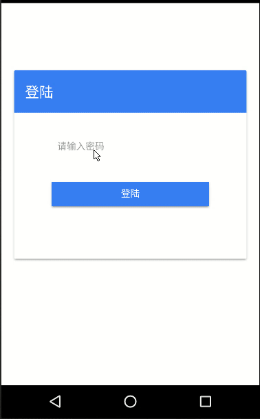

InfoManger
===
A very small information management tool，You can save the encrypted information to `OneDrive`，
And restore from `OneDrive`. Developed using `Angular + redux`. Currently only supports `Android`.

Screenshot
---


Development Background
---
Because now we have too many accounts, to remember all too difficult.So write a tool to save.

Features
---
1. This application does not save passwords for encrypted messages, so you must keep in mind your password.
2. You can back up the encrypted information to `OneDrive`, And restore it from` OneDrive` to avoid losing information.
3. I18N.

The login process
---
1. When the login, check the application directory for encrypted files, if the file does not exist into the application.
2. If there is an encrypted file, use the password to decrypt, if the decryption is successful then into the application, or password is not correct.


Install
---

1. Build the [Ionic2](http://ionicframework.com/docs/intro/installation/) development environment
2. Installing Dependencies

```shell
npm install

ionic plugin add cordova-plugin-file
ionic plugin add https://github.com/zhangtasdq/cordova-plugin-onedrivetool.git
ionic plugin add https://github.com/zhangtasdq/cordova-plugin-aestool.git

```
3.Run

```shell
react-native run-android
```


OneDrive
---
1. Register your application [Here](https://dev.onedrive.com/app-registration.htm#register-your-app-for-onedrive).
2. Write the obtained `clientid` to `src/configs/AppConfig.js#oneDriveClientId`.
3. Sign up for a [Microsoft](https://account.microsoft.com) account.
4. Restart the program.

Finally
---
> I do not know how to design the `state`, if you know I hope you can tell me, thank you!

>If you have any question or suggestions please tell me, thank you !  :)
